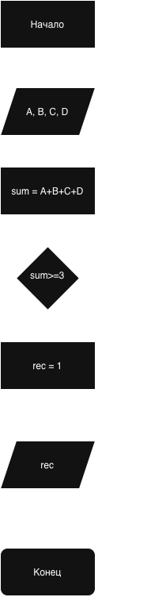

Домашнее задание к работе 4.
Условие задачи. 8. Сигнализация в музее
В зале музея четыре датчика движения (A, B, C, D). Чтобы избежать ложных срабатываний, сигнализация включает запись только если не менее трех датчиков сработали (система интерпретирует срабатывания как "повторяющееся движение", а не "шум"). Запишите условие включения записи.

1. Алгоритм и блок-схема.
   Алгоритм.
     1. Начало
     2. объявить переменные
          A, B, C, D - Состояние датчиков.
          sum - кол-во датчиков стработавших
          rec - включение записи.
     3. Ввод значений A,B,C,D состояния датчиков.
     4. Найти Сумму сработавших: sum = A+B+C+D
     5. Проверить >=3 сработавших датчика.
     6. Вывести результат ведется записи или нет.
    Блок-Схема.

  2. Реализация программы.
  3. Результаты работы программы.
       Введите значения A, B, C, D: 1 0 0 0
       Состояние записи: 0
  4. Информация о разработчике.
       Гуров Егор Алексеевич, бОТИ-261
